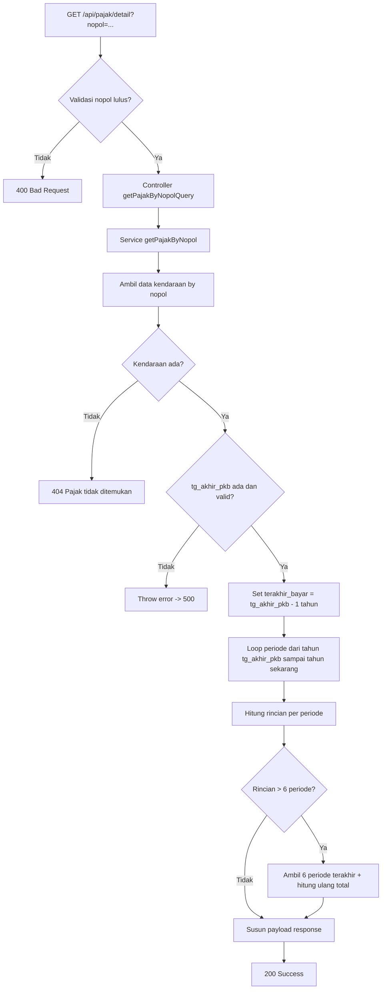
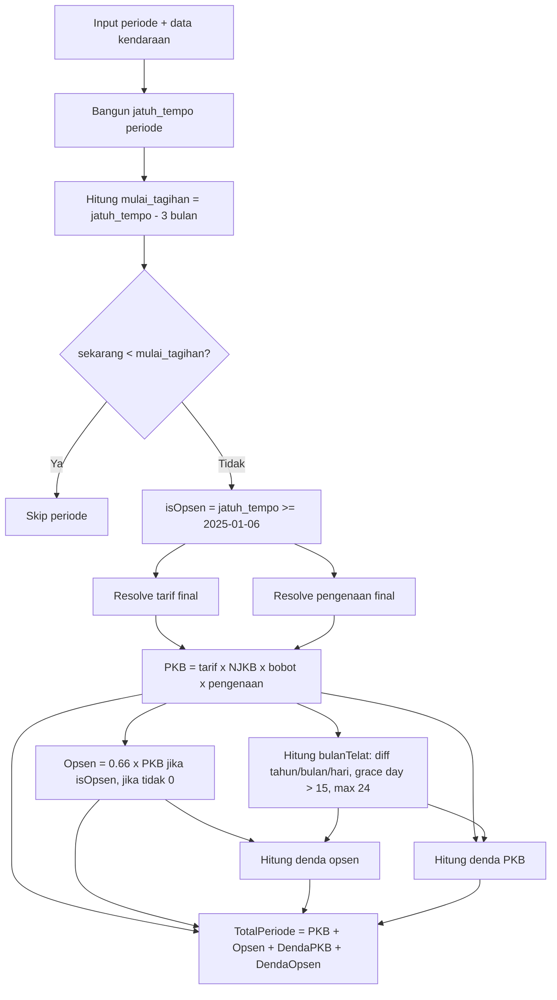

# Dokumentasi Cek Pajak Kendaraan

Dokumen ini memisahkan 2 hal:
1. Alur proses API (siapa panggil siapa, validasi, response).
2. Alur kalkulasi per periode (tarif, pengenaan, opsen, denda).

Tujuan pemisahan ini agar flow mudah dibaca, sementara nilai yang bisa berubah tetap jelas asalnya.

## 1) Flow Proses Endpoint

## 2) Flow Kalkulasi Per Periode

## 3) Rumus Inti

- PKB:
  - PKB = tarif_final x NJKB x bobot x pengenaan_final
- Opsen:
  - Jika isOpsen = true, Opsen = 0.66 x PKB
  - Jika isOpsen = false, Opsen = 0
- Denda PKB:
  - Jika bulanTelat <= 0, DendaPKB = 0
  - Jika bulanTelat > 0, DendaPKB = (baseRate + 0.02 x bulanTelat) x PKB
  - baseRate = 0.01 saat opsen, 0.02 saat non-opsen
- Denda Opsen:
  - Jika non-opsen atau bulanTelat <= 0, DendaOpsen = 0
  - Selain itu, DendaOpsen = (0.01 + 0.01 x bulanTelat) x Opsen
- Total periode:
  - TotalPeriode = PKB + Opsen + DendaPKB + DendaOpsen

## 3.1) Catatan Rumus Lanjutan (Wajib Dicatat)

1. Aturan pembulatan bulan telat (grace period 15 hari):
- Selisih keterlambatan dihitung sebagai tahun, bulan, hari.
- Jika hari keterlambatan > 15, maka bulanTelat ditambah 1 bulan.
- Jika hari keterlambatan <= 15, tidak ada tambahan bulan.
- Jika sekarang <= jatuh_tempo, maka bulanTelat = 0.

2. Batas maksimum bulan denda:
- bulanTelat dibatasi maksimal 24 bulan.
- Rumus: bulanTelatFinal = min(bulanTelatHitung, 24).

3. Periode belum ditagihkan tidak ikut perhitungan:
- mulai_tagihan = jatuh_tempo - 3 bulan.
- Jika sekarang < mulai_tagihan, periode di-skip (tidak masuk rincian dan total).

4. Cutoff opsen dihitung dari jatuh tempo periode, bukan dari tanggal request:
- isOpsen = true jika jatuh_tempo >= 2025-01-06.
- Ini penting karena dalam satu request bisa muncul periode campuran opsen/non-opsen.

5. Normalisasi jatuh tempo saat tanggal tidak valid:
- Jika kombinasi tahun-bulan-hari jatuh_tempo invalid (contoh 31 Februari),
  sistem menggunakan hari terakhir pada bulan tersebut.

6. Batas jumlah periode output mempengaruhi total akhir:
- Jika rincian lebih dari 6 periode, hanya 6 periode terakhir yang dipakai.
- Total PKB, total opsen, total denda, dan grand total dihitung ulang dari 6 periode ini.

7. Catatan presisi nominal (angka desimal):
- Perhitungan PKB/opsen/denda dilakukan dalam number (bisa menghasilkan desimal).
- Format output rupiah menggunakan 2 digit desimal bila perlu.
- Jika desimal bernilai nol, tampilan ",00" dihilangkan.

8. Implikasi audit:
- Total yang ditampilkan mengikuti nilai setelah pembatasan periode (maks 6),
  bukan akumulasi seluruh histori periode sejak awal.

## 3.2) Contoh Hitung Manual (1 Periode)

Contoh ini untuk verifikasi langkah per langkah (angka contoh, bukan data resmi kendaraan tertentu).

Input contoh:
- NJKB = 150000000
- bobot = 1.05
- tarif_final = 0.01
- pengenaan_final = 0.904
- isOpsen = true
- bulanTelat (setelah grace period dan cap) = 4

Langkah hitung:

1. Hitung PKB
- PKB = tarif x NJKB x bobot x pengenaan
- PKB = 0.01 x 150000000 x 1.05 x 0.904
- PKB = 1423800

2. Hitung Opsen
- Opsen = 0.66 x PKB
- Opsen = 0.66 x 1423800 = 939108

3. Hitung Denda PKB (karena bulanTelat > 0)
- baseRate opsen = 0.01
- dendaRatePKB = 0.01 + (0.02 x 4) = 0.09
- DendaPKB = 0.09 x 1423800 = 128142

4. Hitung Denda Opsen
- dendaRateOpsen = 0.01 + (0.01 x 4) = 0.05
- DendaOpsen = 0.05 x 939108 = 46955.4

5. Hitung Total Periode
- TotalPeriode = PKB + Opsen + DendaPKB + DendaOpsen
- TotalPeriode = 1423800 + 939108 + 128142 + 46955.4
- TotalPeriode = 2538005.4

Catatan format output:
- Saat diformat ke Rupiah, nilai desimal akan ditampilkan maksimal 2 angka desimal.
- Jika desimal nol, bagian ,00 dihilangkan.

Checklist validasi cepat:
1. Pastikan bulanTelat sudah melalui aturan hari > 15.
2. Pastikan bulanTelat sudah dibatasi maksimal 24.
3. Pastikan isOpsen diambil dari jatuh_tempo periode.
4. Pastikan tarif_final dan pengenaan_final berasal dari rule kombinasi kode kendaraan.
5. Pastikan periode yang belum masuk jendela tagihan 3 bulan tidak ikut dihitung.

## 3.3) Template Excel Manual

Kalau perhitungan mau dibuat di Excel, maka NJKB, bobot, dan bulan telat saja belum cukup untuk hasil final yang akurat.

Minimal ada 2 pendekatan:

1. Pendekatan input manual penuh
- NJKB
- bobot
- bulanTelat
- isOpsen
- tarif_final
- pengenaan_final

2. Pendekatan input + lookup
- NJKB
- bobot
- bulanTelat
- kode kendaraan / fungsi / plat / jenis
- Excel mengambil tarif_final dan pengenaan_final dari tabel referensi

### Susunan kolom Excel yang disarankan

- A: NJKB
- B: bobot
- C: bulanTelat
- D: isOpsen
- E: tarif_final
- F: pengenaan_final
- G: PKB
- H: Opsen
- I: DendaPKB
- J: DendaOpsen
- K: TotalPeriode

### Rumus Excel

1. PKB
- G2:
  - =A2*B2*E2*F2

2. Opsen
- H2:
  - =IF(D2="YA",G2*66%,0)

3. Denda PKB
- I2:
  - =IF(C2<=0,0,(IF(D2="YA",1%,2%)+(C2*2%))*G2)

4. Denda Opsen
- J2:
  - =IF(OR(D2<>"YA",C2<=0),0,(1%+(C2*1%))*H2)

5. Total Periode
- K2:
  - =G2+H2+I2+J2

### Catatan penting untuk Excel

1. Jika hanya mengisi NJKB, bobot, dan bulanTelat:
- Excel masih butuh tarif_final dan pengenaan_final.
- Jadi nilai tarif dan pengenaan harus diisi manual atau diambil dari lookup table.

2. Jika mau hasil sama seperti service:
- isOpsen harus ditentukan dari jatuh_tempo periode.
- bulanTelat harus mengikuti aturan grace period 15 hari dan cap 24 bulan.

3. Jika perlu lookup table:
- Buat sheet referensi untuk mapping:
  - kd_plat
  - kd_jenis_kb
  - kd_fungsi
  - status opsen
  - tarif_final
  - pengenaan_final

4. Jika pakai Excel locale Indonesia:
- Pemisah argumen bisa memakai titik koma sesuai setting Excel.
- Format persen dan rupiah bisa disesuaikan dengan format cell.

### 3.4) Lookup Tarif dan Pengenaan Otomatis

Kalau kamu ingin mengurangi input manual, pakai sheet referensi terpisah untuk tarif dan pengenaan.

Contoh struktur sheet referensi:

- A: key
- B: kd_plat
- C: kd_jenis_kb
- D: kd_fungsi
- E: isOpsen
- F: tarif_final
- G: pengenaan_final

Isi kolom A dengan key gabungan, misalnya:
- =B2&"|"&C2&"|"&D2&"|"&E2

Di sheet perhitungan, buat key yang sama:
- L2:
  - =M2&"|"&N2&"|"&O2&"|"&D2

Lalu ambil tarif dan pengenaan:

1. tarif_final
- E2:
  - =XLOOKUP(L2,REF!$A:$A,REF!$F:$F,"")

2. pengenaan_final
- F2:
  - =XLOOKUP(L2,REF!$A:$A,REF!$G:$G,"")

Jika Excel kamu belum mendukung XLOOKUP, pakai VLOOKUP dengan key yang sama:
- =VLOOKUP(L2,REF!$A:$G,6,FALSE) untuk tarif
- =VLOOKUP(L2,REF!$A:$G,7,FALSE) untuk pengenaan

### 3.5) Opsional: Rumus Bulan Telat dari Tanggal

Kalau nanti kamu ingin bulanTelat dihitung otomatis dari:
- tanggal jatuh tempo
- tanggal cek / tanggal bayar

maka bisa pakai pola berikut:

- Misal:
  - M2 = jatuh_tempo
  - N2 = tanggal_cek

Rumus bulan telat:
- C2:
  - =MAX(0,MIN(24,IF(DAY(N2)-DAY(M2)>15,DATEDIF(M2,N2,"m")+1,DATEDIF(M2,N2,"m"))))

Catatan:
- Rumus ini mengikuti logika grace period 15 hari.
- Jika tanggal cek belum melewati jatuh tempo, hasil tetap 0.
- Jika selisih bulan lebih dari 24, hasil dibatasi 24.

## 4) Rule Nilai Dinamis (Tarif dan Pengenaan)

Nilai tarif dan pengenaan tidak hard-coded tunggal, tetapi ditentukan oleh kombinasi:
- isOpsen
- kd_plat
- kd_jenis_kb
- kd_fungsi
- (parameter lain tetap diteruskan untuk kompatibilitas)

### 4.1 Rule Tarif (ringkasan)

1. Default (selain plat U dan D):
- Normal: 0.015 (non-opsen) atau 0.01 (opsen)
- Fungsi sosial/keagamaan/ambulance/jenazah/damkar (04,06,07,08):
  - Umum: 0.005
  - Jika jenis A/B: 0.01

2. Plat U:
- Jika jenis C/D/E:
  - Opsen: 0.005
  - Non-opsen: 0.015
- Jenis lain: ikut default

3. Plat D:
- Selalu 0.005

### 4.2 Rule Pengenaan (ringkasan)

1. Default (selain plat U dan D):
- Normal: 1.0 (non-opsen) atau 0.904 (opsen)
- Fungsi sosial/keagamaan/ambulance/jenazah/damkar (04,06,07,08):
  - Umum: 1.0
  - Jika jenis A/B: 1.0 (non-opsen) atau 0.904 (opsen)

2. Plat U:
- Jika jenis C/D/E:
  - Opsen: 0.6
  - Non-opsen: 1.0
- Jenis lain: ikut default

3. Plat D:
- Selalu 0.5

## 5) Catatan Implementasi Penting

1. Periode tagihan hanya dihitung jika sudah masuk jendela 3 bulan sebelum jatuh tempo.
2. Keterlambatan memakai gaya PHP (hari > 15 menambah 1 bulan), dengan batas maksimal 24 bulan.
3. Respons akhir membatasi rincian ke 6 periode terakhir.
4. Jika data tanggal PKB hilang atau format tanggal tidak valid, service melempar error.

## 6) Sumber Kode

- src/modules/pajak/pajak.service.ts
- src/shared/calculation/pajak.helper.ts
- src/utils/penalty-month.util.ts
- src/modules/pajak/pajak.validation.ts
- src/modules/pajak/pajak.controller.ts
- src/modules/kendaraan/kendaraan.service.ts
